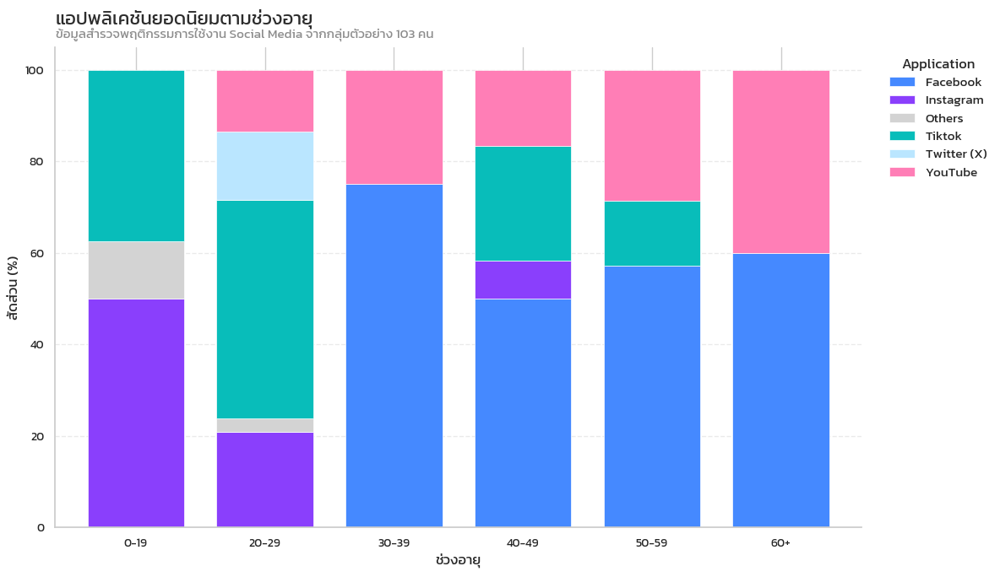
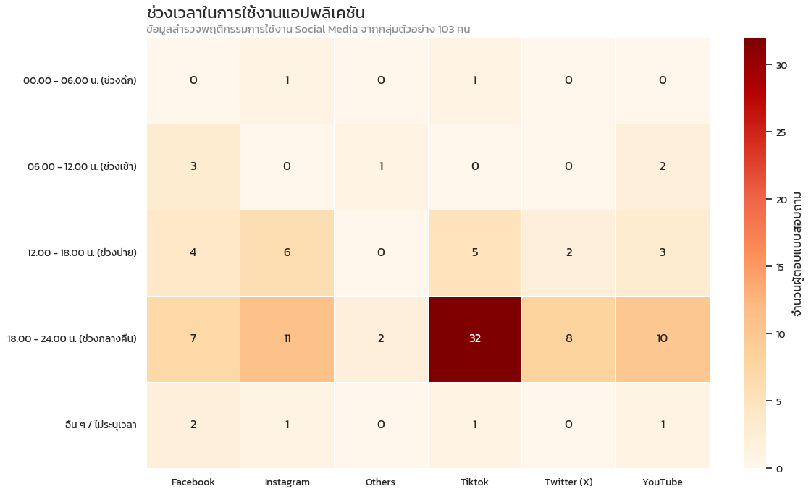
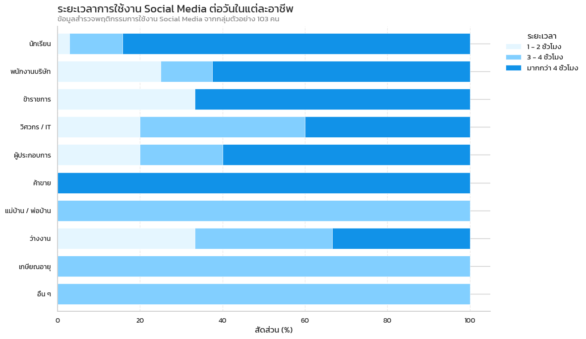
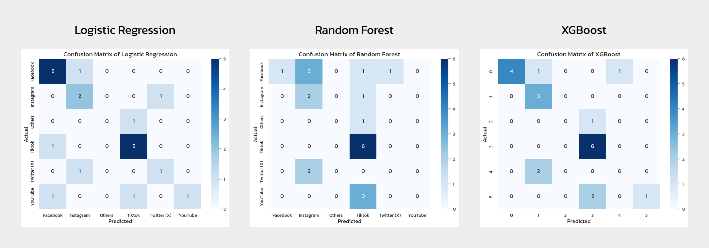

# Social Media Usage Behavior Analysis

**Hi Everyone !!**

Social media has become a very important part of our daily lives. People of all ages and careers use platforms like Facebook, TikTok, Instagram, and Twitter. However, everyone uses them differently. Some people use them for work, while others use them for entertainment.

This project aims to understand these different behaviors and patterns.

[Click here to view full notebook](./Social_Media_Project.ipynb)

---

## Objectives

The main goals of this project are:

- **To analyze user behavior:** We want to understand how much time people spend on social media and when they are most active.
- **To compare different groups:** We want to see the differences between gender, jobs and age groups.
- **To predict user preferences:** We aim to build a Machine Learning model to predict a user's favorite app based on their personal information and usage habits.

---

## About the Dataset

The dataset used in this project is **primary data** that we collected ourselves. We conducted an online survey using **Google Forms** to gather information about social media behavior.

- **Sample Size:** The dataset consists of **103 responses** from various participants.

- **Key Features:**
  - **Demographics:** Age, Gender, and Jobs.
  - **Usage Statistics:** Daily usage hours, active time periods, and years of usage.
  - **User Opinions:** Reasons for using social media and reasons for choosing their favorite app.

---

## Tools and Technologies

- **Data Processing & Cleaning:** Python, Pandas, NumPy
- **Data Visualization:** Matplotlib, Seaborn
- **Model Training:** Scikit-learn (Pipeline, ColumnTransformer), XGBoost
- **Development Environment:** Jupyter Notebook, VS Code

---

## Key Insights

Here are some interesting findings from our data analysis:

### 1. Favorite Application by Age Group

- Users under the age of 30 are gradually shifting away from Facebook. Instead, they show a strong preference for visual and short-form video platforms like TikTok and Instagram.
- For users aged 30 and above, Facebook remains the primary application, accounting for **over 50%** of usage across all subgroups. This is likely due to established social connections with friends and family who are still active on this platform.
- Among students and teenagers, **TikTok** is the most influential platform, followed closely by Instagram. This reflects a consumption behavior that values speed, entertainment, and personalized content.

### 2. Peak Usage Times by Application

- **Nighttime is Prime Time:** The majority of respondents prefer using social media applications during the Night.
- **Top Apps at Night:** During these late hours, **TikTok** has the highest number of active users, followed by **Instagram** and **YouTube**.

### 3. Daily Usage Hours by Job

- **Overall Trend:** The majority of respondents are heavy social media users, spending **more than 4 hours per day** online.

- **High Usage Group (more than 4 hours):** Jobs such as **Students**, **Office Workers**, **Government Officials**, **Entrepreneurs**, and **Vendors** mostly fall into this category. Their lifestyle or work nature likely contributes to extended screen time.

- In contrast, **Homemakers** and **Retirees** tend to spend slightly less time, averaging between 3 to 4 hours daily.

---

## Model Performance

We compared three machine learning models: **Logistic Regression**, **Random Forest**, and **XGBoost**.

### Why Logistic Regression Won?

Although accuracy was similar across models, **Logistic Regression** was selected as the final model because:

1.  **High Recall for Minority Classes:** It was the only model capable of correctly identifying users who prefer less popular apps like **Twitter**.
2.  **Balanced Prediction:** It achieved the highest **Macro F1-Score (0.52)**, proving it doesn't just bias towards majority classes.

| Model                   | Accuracy | Precision (Macro) | Recall (Macro) | F1-Score (Macro) |
| ----------------------- | -------- | ----------------- | -------------- | ---------------- |
| **Logistic Regression** | **0.67** | **0.57**          | **0.53**       | **0.52**         |
| XGBoost                 | 0.67     | 0.53              | 0.50           | 0.46             |
| Random Forest           | 0.43     | 0.30              | 0.31           | 0.23             |

### Confusion Matrix Comparison

As shown in the Confusion Matrix, Logistic Regression is the only model capable of correctly identifying **Twitter (X)** users (minority class). In contrast, XGBoost and Random Forest completely failed to predict this class (predicted count equal to 0).

---

## Deployment and Business Application

To demonstrate the practical value of our model, we developed a web application named **"Social Media Prediction"**. This application utilizes our best-performing model (**Logistic Regression**) to predict a user's favorite social media platform in real-time.

**Features:**

- **User Profiling:** The app collects demographic data such as **Age**, **Gender**, and **Job**.
- **Behavioral Inputs:** Users can specify their **Daily Usage Hours**, **Active Hours**, and **Years of Usage**.
- **In-depth Analysis:** Our app asks for **"Usage Purposes"** and **"Reasons for Liking an App"** (e.g., Easy to use, Content interest, Community), which allows the model to analyze complex user preferences.

**How it works:**

1.  **Input:** Users fill in the form with their personal details and usage behaviors.
2.  **Process:** The backend model processes these inputs.
3.  **Output:** The system instantly predicts which Social Media app is likely to be the user's favorite.

**Business Value:**
This tool serves as a prototype for digital marketers to understand their target audience better. By inputting customer personas, businesses can predict the most effective platform for their marketing campaigns.

**Live Demo:** [Click here to try the web app](https://social-media-prediction-g8a3.onrender.com/)

---

## About me

**Phawadon Nuresaard**

Bachelor of Engineering, IoT Systems & Information Engineering, KMITL

**Key Contributions:**

- Managed Data Cleaning, Data Preprocessing, Feature Engineering, and Model Training.

- Enhanced and refined data visualizations to improve readability and storytelling impact.

**Interested in:** AI/ML and Data Analytics
